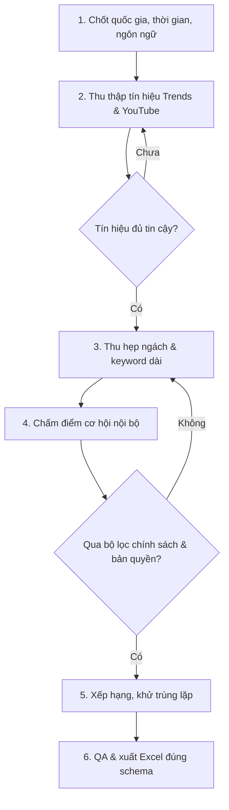

<p align="center">
  
</p>

<h1 align="center">YouTube Faceless Trend Research — United States</h1>

<p align="center">
  <strong>50 specific channel niches and primary keywords for April–September 2026</strong><br>
  A transparent, reusable workflow built around demand signals, long-tail opportunity, monetization, originality, and policy safety.
</p>

<p align="center">
  
  
  
  
  
</p>

## Giới thiệu

Repository này lưu trữ trọn bộ kết quả nghiên cứu chủ đề YouTube Faceless cho thị trường Hoa Kỳ trong giai đoạn **04/2026–09/2026**. Danh sách cuối gồm 50 ngách cụ thể, viết bằng tiếng Anh và được xếp hạng theo đánh giá tổng hợp về nhu cầu, thời điểm tăng trưởng, khoảng trống cạnh tranh, khả năng sản xuất bằng AI, tiềm năng kiếm tiền và độ an toàn chính sách/bản quyền.

AI được xem là **công cụ sản xuất** cho kịch bản, hình ảnh, giọng đọc và video; không phải giới hạn chủ đề nghiên cứu vào nội dung về AI.

> **Phạm vi dữ liệu:** giai đoạn tháng 9 được đánh giá theo dữ liệu công khai có thể kiểm chứng đến **12/09/2026**. Repository không công bố số lượt tìm kiếm, điểm Google Trends hay tỷ lệ tăng trưởng chưa được xác minh.

## Tải kết quả

| Deliverable | Nội dung | Tải xuống |
| --- | --- | --- |
| Excel chính | 50 dòng, đúng 3 cột `STT`, `Chủ đề`, `Keyword` | [Chu-de-YouTube-Faceless-Hoa-Ky-04-2026-09-2026.xlsx](deliverables/Chu-de-YouTube-Faceless-Hoa-Ky-04-2026-09-2026.xlsx) |

**SHA-256:** `25b341830537f937c27efada317d10804db29ab22f61c4e96bc2746798400866`

## Điểm nổi bật

| Tiêu chí | Cách xử lý |
| --- | --- |
| Tín hiệu nhu cầu | Ưu tiên Google Trends/YouTube Search; đối chiếu autocomplete, video traction và nguồn công khai đáng tin cậy |
| Cạnh tranh | Chuyển chủ đề rộng hoặc bão hòa thành ngách và keyword dài hơn |
| Khả năng mở rộng | Chỉ giữ ý tưởng có thể phát triển thành series video dài và Shorts |
| Sản xuất bằng AI | Ưu tiên nội dung có thể minh họa nguyên bản bằng đồ họa, narration và video tạo mới |
| Kiếm tiền | Đánh giá AdSense, affiliate, tài trợ và sản phẩm số |
| Chính sách & bản quyền | Loại nội dung phụ thuộc clip/nhạc có bản quyền, tổng hợp đơn giản hoặc thiếu giá trị mới |

## Flowchart nghiên cứu



## Workflow có thể tái sử dụng

Quy trình được chuẩn hóa để chạy lại cho quốc gia, thời gian và số lượng chủ đề khác:

1. Nhận brief và khóa hợp đồng đầu ra.
2. Tạo tập ứng viên lớn hơn 2–4 lần số lượng cần giao.
3. Thu thập và ghi nguồn cho từng tín hiệu.
4. Xác nhận nhu cầu bằng nhiều tín hiệu độc lập khi có thể.
5. Thu hẹp chủ đề cạnh tranh cao thành long-tail cụ thể.
6. Áp dụng các cổng loại về demand, originality, AI fit, policy và copyright.
7. Chấm điểm nội bộ, xếp hạng và khử trùng lặp ý định tìm kiếm.
8. Kiểm tra ngôn ngữ, số dòng, header, filename và khả năng mở file.
9. Giao workbook kèm giới hạn dữ liệu, không đưa số liệu chưa kiểm chứng.

Xem [quy trình vận hành chi tiết](docs/04-QUY-TRINH-TAI-SU-DUNG.md) hoặc dùng trực tiếp [skill nghiên cứu YouTube Faceless](skills/researching-youtube-faceless-topics/SKILL.md).

## Cấu trúc repository

```text
.
├── assets/
│   └── youtube-faceless-research-workflow.svg
├── deliverables/
│   └── Chu-de-YouTube-Faceless-Hoa-Ky-04-2026-09-2026.xlsx
├── docs/
│   ├── 01-YEU-CAU-VA-FEEDBACK.md
│   ├── 02-TONG-HOP-HOI-THOAI.md
│   ├── 03-PHUONG-PHAP-VA-NGUON.md
│   └── 04-QUY-TRINH-TAI-SU-DUNG.md
└── skills/
    └── researching-youtube-faceless-topics/
        ├── SKILL.md
        ├── agents/openai.yaml
        └── references/workflow.md
```

## Tài liệu

- [Yêu cầu và feedback](docs/01-YEU-CAU-VA-FEEDBACK.md)
- [Tổng hợp hội thoại](docs/02-TONG-HOP-HOI-THOAI.md)
- [Phương pháp và nguồn](docs/03-PHUONG-PHAP-VA-NGUON.md)
- [Quy trình tái sử dụng](docs/04-QUY-TRINH-TAI-SU-DUNG.md)
- [Skill definition](skills/researching-youtube-faceless-topics/SKILL.md)

## Nguyên tắc sử dụng

Kết quả là danh sách ưu tiên để lập kế hoạch nội dung, không phải cam kết về lượt xem hay doanh thu. Khi triển khai kênh, mỗi video vẫn cần kịch bản, lời bình, dẫn chứng và biên tập nguyên bản để tạo giá trị mới và đáp ứng chính sách kiếm tiền của YouTube.
