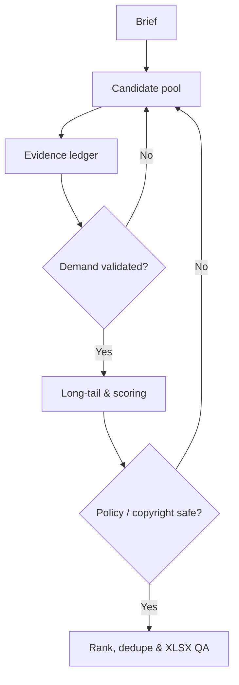

# Quy trình tái sử dụng: nghiên cứu chủ đề YouTube Faceless

Tài liệu này chuẩn hóa cách biến một brief ngắn thành danh sách ngách YouTube Faceless có thể kiểm tra, xếp hạng và xuất Excel. Quy trình có thể dùng lại cho thị trường, ngôn ngữ, khoảng thời gian và số lượng chủ đề khác.

## 1. Đầu vào bắt buộc

| Trường | Ví dụ |
| --- | --- |
| Quốc gia mục tiêu | United States |
| Khoảng thời gian | 04/2026–09/2026 |
| Số lượng chủ đề | 50 |
| Ngôn ngữ khán giả | English |
| Schema đầu ra | `STT`, `Chủ đề`, `Keyword` |
| Tên file | `Chu-de-YouTube-Faceless-[QUOC-GIA]-[THOI-GIAN].xlsx` |

Nếu tháng cuối chưa kết thúc, phải ghi rõ ngày chốt dữ liệu. Không so sánh tháng chưa hoàn tất như một tháng đầy đủ.

## 2. Pipeline vận hành

### Bước 1 — Khóa brief

Xác nhận đúng quốc gia, ngôn ngữ khán giả, mốc thời gian, số dòng, số cột, thứ tự header và tên file. Không hỏi lại thông tin người dùng đã cung cấp.

### Bước 2 — Tạo seed clusters

Tạo tập ứng viên lớn hơn 2–4 lần số lượng cần giao, phủ các nhóm:

- mùa vụ, sự kiện và deadline;
- how-to, troubleshooting và giáo dục;
- so sánh sản phẩm và ý định mua;
- tài chính cá nhân, nghề nghiệp, gia đình, du lịch, sở thích;
- chủ đề evergreen có nhu cầu lặp lại.

AI là phương tiện sản xuất, không mặc định là chủ đề của kênh.

### Bước 3 — Thu thập tín hiệu

Ưu tiên theo thứ tự:

1. Google Trends với đúng quốc gia, thời gian và thuộc tính **YouTube Search**.
2. YouTube autocomplete và kết quả tìm kiếm hiện tại.
3. Hiệu suất tương đối của video gần đây trên nhiều kênh.
4. Lịch sự kiện, nguồn chính phủ, hiệp hội ngành và tài liệu nền tảng.
5. Báo cáo xu hướng công khai đáng tin cậy để đối chiếu.

Lưu sổ bằng chứng nội bộ gồm: chủ đề, keyword, nguồn, ngày quan sát, thị trường/search property, loại tín hiệu, mức tin cậy và giới hạn dữ liệu.

### Bước 4 — Kiểm chứng nhu cầu

Khi có thể, mỗi ứng viên cuối cần ít nhất hai tín hiệu độc lập. Phân biệt rõ dữ liệu trực tiếp, proxy, suy luận và dữ liệu giai đoạn chưa hoàn tất. Không chuyển tín hiệu định tính thành số volume hoặc phần trăm tăng trưởng tự bịa.

### Bước 5 — Thu hẹp long-tail

Dùng công thức:

`audience + problem + format + timing + product/category`

Ví dụ: `travel` → `carry-on packing for European summer trips`.

Một chủ đề đạt yêu cầu phải đủ cụ thể để định hướng series nội dung nhưng không hẹp đến mức chỉ làm được một video.

### Bước 6 — Cổng loại bắt buộc

Loại ngay khi ứng viên không đạt một trong các tiêu chí:

- bằng chứng nhu cầu đủ mạnh;
- mức độ cụ thể và khác biệt;
- khả năng làm nhiều video dài và Shorts;
- khả năng tạo hình, video, voice và kịch bản nguyên bản bằng AI;
- tiềm năng AdSense, affiliate, tài trợ hoặc sản phẩm số;
- không phụ thuộc clip, nhạc, phát sóng hoặc nhân vật có bản quyền;
- có thể tạo giá trị mới, không phải nội dung tổng hợp hàng loạt;
- rủi ro chính sách và hạn chế kiếm tiền ở mức chấp nhận được.

### Bước 7 — Chấm điểm nội bộ

Chấm 0–5 cho sáu chiều, dùng để xếp hạng tương đối:

| Chiều đánh giá | Trọng số mặc định |
| --- | ---: |
| Nhu cầu | 25% |
| Tăng trưởng/thời điểm | 15% |
| Khoảng trống cạnh tranh | 20% |
| Khả năng sản xuất bằng AI | 15% |
| Kiếm tiền | 15% |
| An toàn chính sách/bản quyền | 10% |

Điểm này là đánh giá của nhà nghiên cứu, không phải chỉ số của Google hay YouTube. Không đưa điểm vào workbook nếu người dùng không yêu cầu.

### Bước 8 — Xếp hạng và khử trùng lặp

Sắp xếp từ tiềm năng cao xuống thấp. Loại keyword trùng, topic trùng và các dòng khác chữ nhưng cùng ý định tìm kiếm. Mỗi dòng chỉ giữ một keyword chính tự nhiên trong ngôn ngữ khán giả.

### Bước 9 — QA và xuất file

Checklist trước khi bàn giao:

- đúng số dòng và STT bắt đầu từ 1;
- đúng số cột, tên header và thứ tự;
- không có ô trống, dòng lặp, cột ẩn hoặc sheet phụ ngoài yêu cầu;
- không trộn ngôn ngữ;
- filename và phần mở rộng `.xlsx` chính xác;
- workbook mở lại được và đã kiểm tra trực quan;
- ghi giới hạn dữ liệu bên ngoài sheet nếu schema bị giới hạn.

## 3. Flow kiểm soát chất lượng

## 4. Hợp đồng đầu ra mặc định

Khi brief yêu cầu đúng ba cột, workbook chỉ chứa:

| STT | Chủ đề | Keyword |
| ---: | --- | --- |
| 1 | Một ngách cụ thể | Một keyword chính |

Phương pháp, nguồn, scoring và giới hạn dữ liệu phải được bàn giao trong README/tài liệu đi kèm, không tự ý thêm cột.

## 5. Điều kiện hoàn tất

Một lần chạy chỉ được xem là hoàn tất khi file đã mở kiểm tra, số dòng/schema đúng brief, keyword không trùng, giới hạn dữ liệu được công bố và mọi nhận định định lượng đều có nguồn xác minh.
